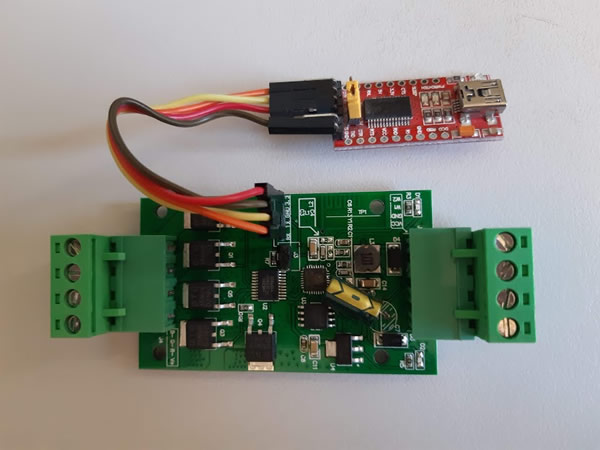

# ESP8266-H801-MQTT

ESP8266 / H801 RGB controller using MQTT and WiFi - With programming via the Arduino IDE 

I have had to re-visit this repository because the wifi manager library seems to have connection problems with the ESP8166EX chip

Just in case it does get fixed, I have the left the original sketch in (called "mqtt_withparms_RGB.ino"). However, in the mean time, I have added the following 2 replacement programs which will work OK
 - __mqtt_H801_send_in_network.py__ 
   - _This is an example python program that you can execute in your desktop to control the LED strip via MQTT_
   - _Please see the program comments on how to use_
   - _Reference info can be found here_
     - https://www.emqx.com/en/blog/how-to-use-mqtt-in-python#full-python-mqtt-code-example
     
   
 - __H801_MQTT.ino__ 
   - _This is the Arduino code that you need to flash into the H801_
   - _Please see the program comments on how to use_
   - _Reference info can be found here_
     - https://www.inspectmygadgets.com/flashing-the-h801-led-controller-with-tasmota-firmware/
     - https://tasmota.github.io/docs/devices/H801/#hardware
       

# Old References (for the old "wifi manager" version - not needed now)
This is based on the following sources

https://eryk.io/2015/10/esp8266-based-wifi-rgb-controller-h801/

https://github.com/tzapu/WiFiManager

https://github.com/knolleary/pubsubclient
